# Introduction

The travelling salesman problem (TSP) asks the following question: "Given a list of cities and the distances between each pair of cities, what is the shortest possible route that visits each city and returns to the origin city ?

pyTSP uses various approaches to solve the TSP (linear programming, construction heuristics, optimization heuristics, genetic algorithm).
It provides a geographical step-by-step visualization of each of these algorithms.


**You can find a <a href="http://mintoo.pythonanywhere.com/" target="_blank">demo of pyTSP here !</a> (U.S cities with a population larger than 900 000 inhabitants)**

# Algorithms

The following algorithms are implemented in pyTSP:

- Construction heuristics
  - Nearest neighbor
  - Nearest insertion
  - Farthest insertion
  - Cheapest insertion
- Linear programming
- Optimization heuristics
  - Pairwise exchange (2-opt)
  - Node insertion
  - Edge insertion
- Genetic algorithm

# Construction heuristics

## Nearest neighbor

```
- Start from a random city.
- Travel to the nearest unvisited city.
- Repeat until every city has been visited.
```

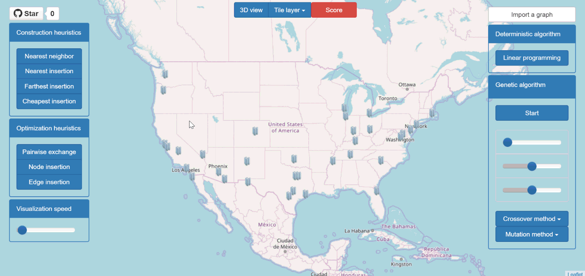

## Nearest insertion

<pre>
- Start from a random city.
- Find the city closest to the partial tour, i.e the city <b>i</b> which minimizes <b>d(i, j)</b>
with <b>j</b> a city already in the tour.
- Insert <b>i</b> before or after <b>j</b>, depending on which option is shorter.
- Repeat until every city has been visited.
</pre>

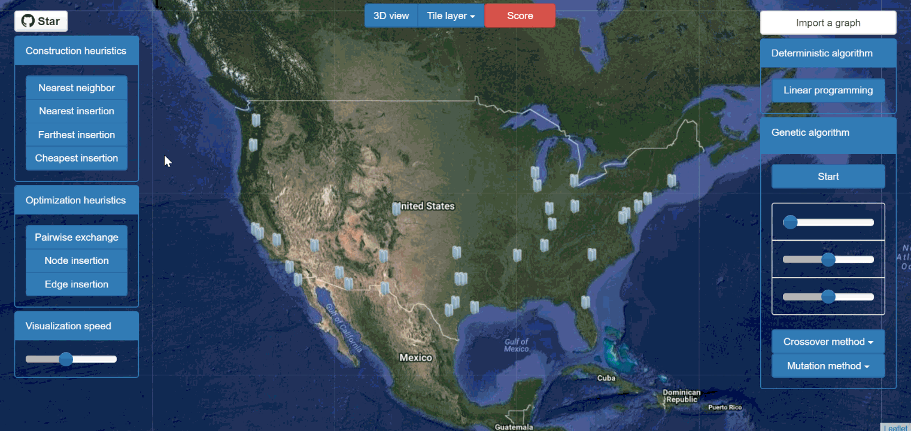

## Cheapest insertion

<pre>
- Start from a random city.
- Find the city which insertion in the tour causes the smallest increase in length,  
i.e the city <b>k</b> which minimizes <b>d(i, k)  + d(k, j) - d(i, j)</b> with <b>(i, j)</b> an edge in the partial tour.
- Insert <b>k</b> between <b>i</b> and <b>j</b>.
- Repeat until every city has been visited.
</pre>

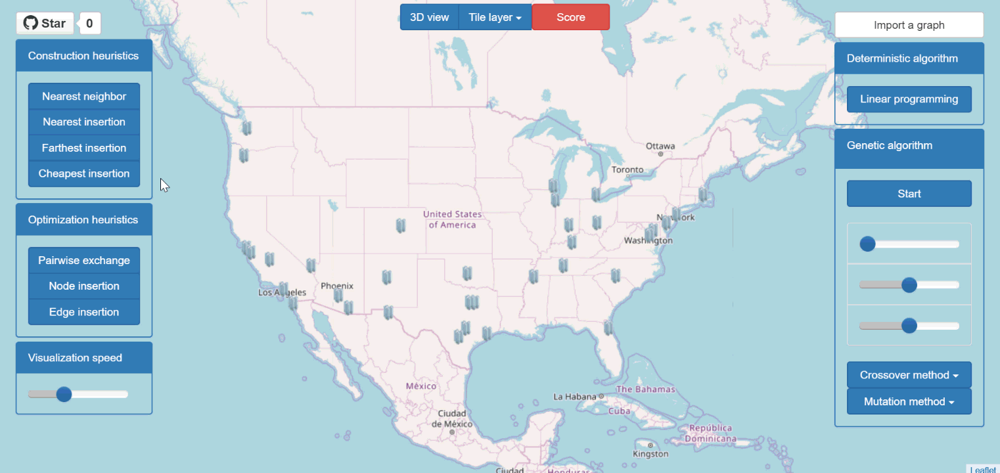

## Farthest insertion

<pre>
- Start from a random city.
- Find the city <b>k</b> farthest from any node in the tour (i.e the city <b>k</b> which maximizes <b>d(c, k)</b> with <b>c</b>
a city in the partial tour), and insert <b>k</b> where it causes the smallest increase in length 
(by minimizing <b>d(i, k)  + d(k, j) - d(i, j)</b>, with <b>(i, j)</b> an edge in the partial tour).  
- Repeat until every city has been visited.
</pre>

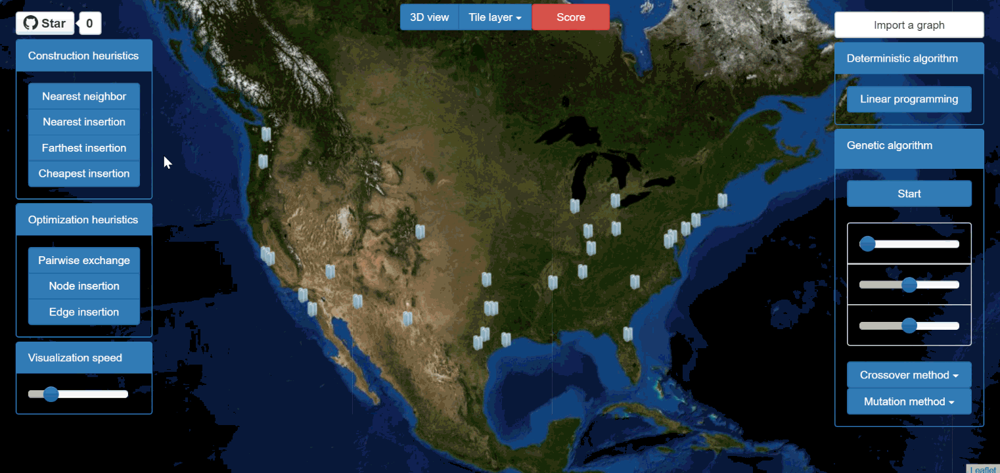

# Linear programming


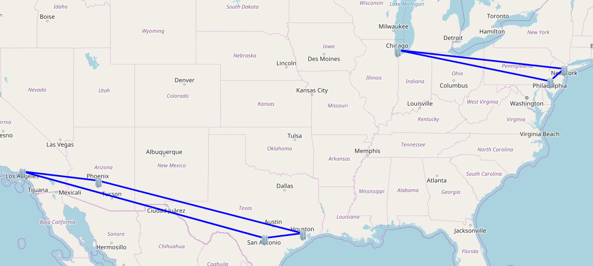

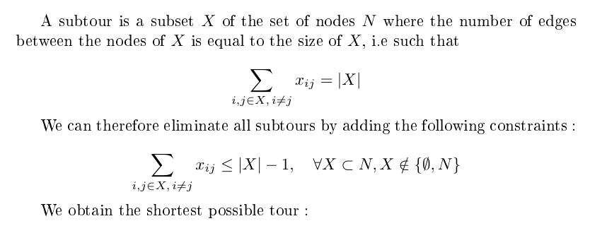


**Note**: there is an exponentially growing number of subtour constraints, which makes this algorithm inefficient for larger instances of the TSP. One way to improve it is to use lazy constraints, i.e ignore the subtour constraints and eliminate them one by one when looking for a feasible solution.

# Optimization heuristics

## Pairwise exchange (2-opt)

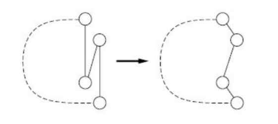

```
- Given a pair of edges, there is only one way of deleting and reconnecting the edges to obtain
a valid tour. If this new tour is shorter, make the change.
- Repeat for any pair of edges until no further improvement can be made.
```

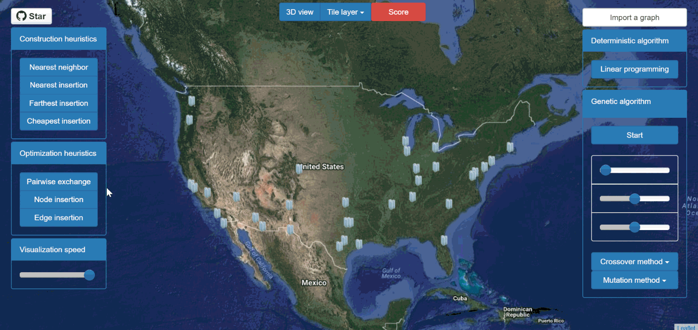

## Node insertion

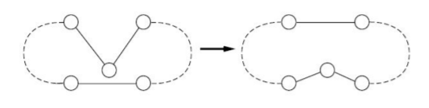

```
- Given a node, remove it from the tour and insert it at the best possible position.
- Repeat for any node until no further improvement can be made.
```

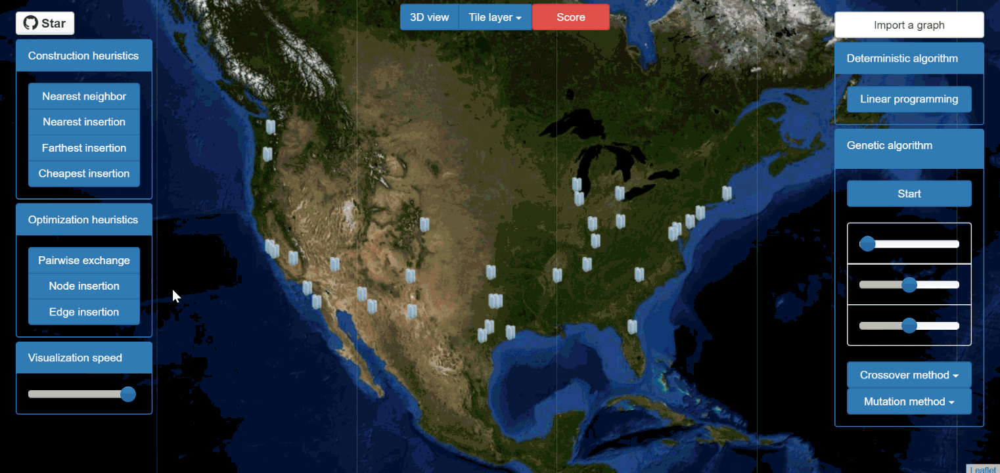

## Edge insertion

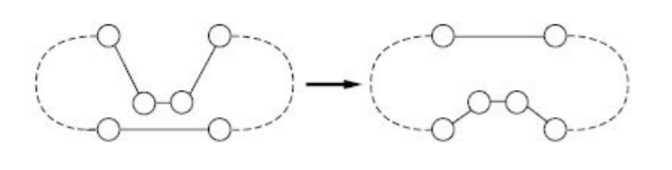

```
- Given an edge, remove it from the tour and insert it at the best possible position.
- Repeat for any edge until no further improvement can be made.
```

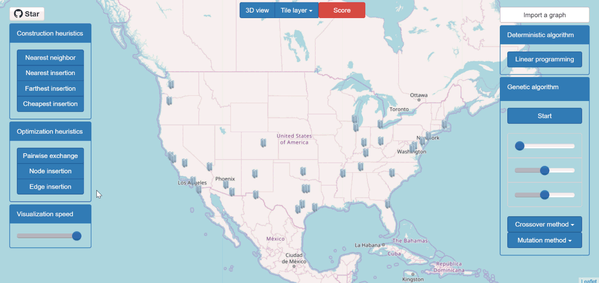

# Genetic algorithm

pyTSP implements a genetic algorithm with the following properties:
- 3 mutation methods: random swap, insertion or displacement.
- 3 crossover methods: order, maximally preservative, or partially mapped.
- Selection: at each generation, 30 individuals are chosen randomly, and the 10 best are kept for the next generation.
- Mutation and crossover rates default to 50%. They can be modified with sliders.

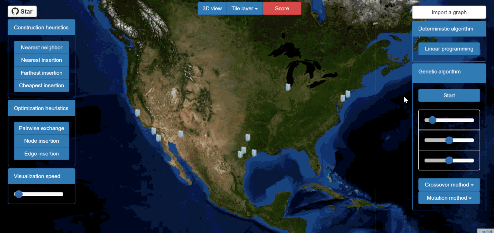

**Note**: the genetic algorithm is processed by the server, and websockets (or long-polling if the server does not support websockets) are used to update the display client-side every new generation.

# Getting started

The following modules are used in pyTSP:
```
flask
flask_socketio (sockets)
flask_sqlalchemy (database)
numpy (linear programming)
cvxopt (linear programming)
xlrd (graph import)
```

In order to use pyTSP, you need to:
    
- (optional) set up a [virtual environment](https://docs.python.org/3/library/venv.html) .

- clone pyTSP (or download as a zip archive from github)
```
git clone https://github.com/afourmy/pyTSP.git
```
    
- install the requirements
```
cd pyTSP
pip install -r requirements.txt
```

- run **/flask_app.py**.
```
python flask_app.py
```

- go the http://127.0.0.1:5000/.

# Credits 

[Bootstrap](https://getbootstrap.com/ "Bootstrap"): Front-end HTML/CSS framework.

[Bootstrap slider](http://seiyria.com/bootstrap-slider/): A slider component for Bootstrap.

[CVXOPT](https://github.com/cvxopt/cvxopt): A library for convex optimization.

[Flask](http://flask.pocoo.org/ "Flask"): A microframework based on the Werkzeug toolkit and Jinja2 template engine.

[Flask SQLAlchemy](http://flask-sqlalchemy.pocoo.org/ "Flask SQLAlchemy"): Adds support for SQLAlchemy to Flask.

[Jquery](https://jquery.com/ "Jquery"): JavaScript library designed to simplify the client-side scripting of HTML.

[Leaflet](http://leafletjs.com/ "Leaflet"): JavaScript library for mobile-friendly interactive maps.

[OpenStreetMap](https://www.openstreetmap.org/ "OpenStreetMap"): Collaborative project to create a free editable map of the world.

[WebGL Earth](http://www.webglearth.org "WebGL Earth"): 3D digital globe for web and mobile devices.

[xlrd](https://github.com/python-excel/xlrd): Library to extract data from Microsoft Excel (tm) spreadsheet files.